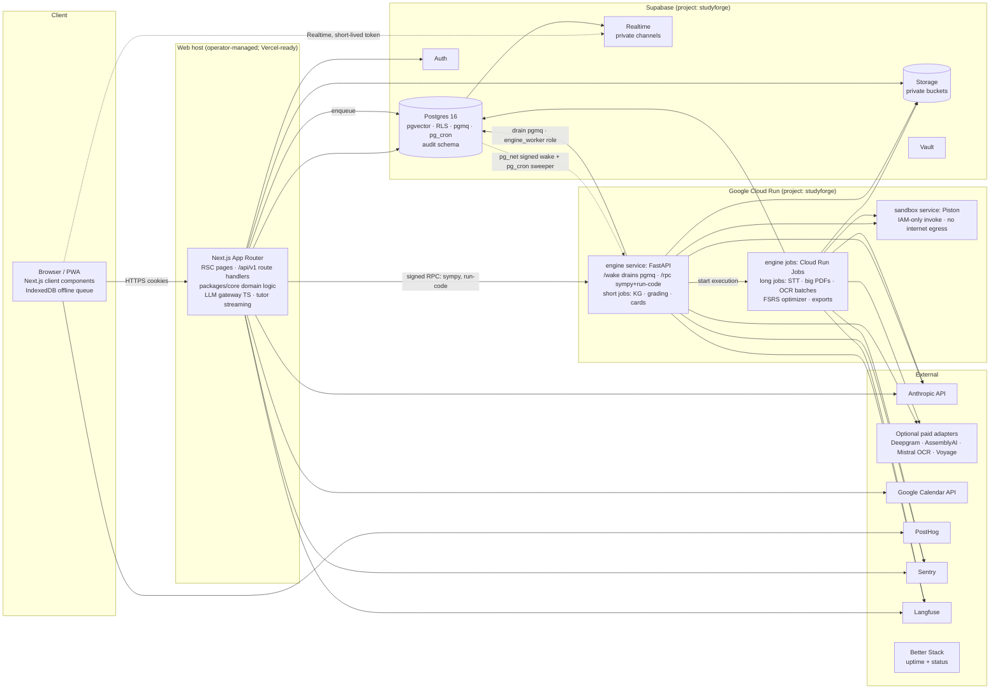

# 02: Architecture & Stack

## 1. Shape of the system
A **modular monolith** made of three deployables, plus managed services. The web app and the engine talk through the database: jobs go through the pgmq queue, and state changes go through tables and Realtime. They never call each other directly, except for two low-latency internal RPCs from web → engine (SymPy check and code run), which are signed.

**Web tier hosting (ADR-0014):** at this stage the Next.js app runs as a **production build on an operator-managed host** (`pnpm start:prod`, which reads `.env.production`), pointed at the cloud Supabase and Google Cloud projects. All data, auth and files live in the cloud, never on the host. The code must stay deployable **unchanged** to Vercel or Cloud Run (no host-specific APIs, stateless, config only through env vars), and adding a hosted web tier later must be a deployment task, not a code change.

The engine runs on **Google Cloud Run** and **scales to zero**. It is not a forever-running poller; it is **woken on demand** (see §5.0): enqueueing a job also sends a signed *wake* request to the engine, which drains the queue and exits. A pg_cron *sweeper* re-sends the wake if anything sits in the queue too long. Long work is handed off to **Cloud Run Jobs** (batch executions with a much longer time limit than a request).



## 2. Stack (pinned choices)
| Layer | Choice | Notes |
|---|---|---|
| Monorepo | **pnpm workspaces + Turborepo** | `uv` for Python |
| Web | **Next.js (latest stable, App Router) + React + TypeScript `strict`** | Route groups: `(marketing)`, `(auth)`, `(app)`, `(admin)`; `/api/v1/*` route handlers |
| UI | **Tailwind CSS + shadcn/ui (Radix)**, lucide icons | Design tokens in `packages/ui/tokens.css`; Storybook for components |
| Data fetching | TanStack Query (client), RSC for reads | zod schemas shared from `packages/contracts` |
| Forms | react-hook-form + zod | |
| Math/code | **KaTeX** (MathML+HTML output), **MathLive** input, **Shiki** highlighting, CodeMirror 6 editor | |
| Charts | Recharts + a custom heatmap (SVG) | Follow the vault's dataviz conventions |
| PWA | Serwist (service worker), IndexedDB via `idb` | |
| i18n | next-intl (en only at launch) | |
| DB | **Supabase Postgres + pgvector (HNSW) + pg_trgm + pgmq + pg_cron + pg_net** | Migrations via Supabase CLI |
| DB access (TS) | supabase-js with user JWT (RLS applies) for user paths; generated types (`supabase gen types`) | Service-role client isolated in `lib/server/admin-db.ts` |
| DB access (Py) | `psycopg` 3 (async) with SQL files + pydantic models | Engine uses a dedicated `engine_worker` Postgres role (not `postgres`) with explicit grants (ADR-0007) |
| Auth | **Supabase Auth**: email/password, magic link, Google OIDC, TOTP MFA, (passkeys ADR-0005) | `@supabase/ssr` HttpOnly cookies |
| Storage | Supabase Storage (S3-compatible), TUS resumable uploads | Buckets: `uploads`, `derived`, `exports`, `avatars` (all private) |
| Queue | **Supabase Queues (pgmq)** + a `jobs` table for state/progress | pg_net sends the signed wake request to Cloud Run; pg_cron for the sweeper + schedules |
| Engine | **Python 3.12, FastAPI**, Docker (slim, non-root), deployed as a **Cloud Run service** (short work, `/wake`, `/rpc/*`) and **Cloud Run Jobs** (long work) from the **same image** | Libraries: Docling, PyMuPDF, python-pptx, python-docx, faster-whisper, PaddleOCR, fastembed, py-fsrs, SymPy, genanki, anthropic |
| Sandbox | **Piston** (self-hosted) as a separate **Cloud Run service**: invoker = the engine's service account only (IAM, no public access); **no internet egress** (Direct VPC egress with all traffic routed into a VPC that has no Cloud NAT) | CPU/mem/time limits per run |
| LLM | Anthropic SDK (`@anthropic-ai/sdk`, `anthropic`) behind the gateway (doc 06) | |
| Rate limit / cache | **Postgres (Supabase)**: an `UNLOGGED` `private.rate_limit_buckets` table + `private.rate_limit_hit(key, limit, window_s)` (sliding window / token bucket, one atomic statement), called from API middleware and security-definer RPCs; pg_cron purges expired buckets (ADR-0016) | Hot entitlements cached per request; a `RateLimiter` interface so a Redis-backed implementation can be swapped in without touching callers |
| Email | **`EmailProvider` interface + React Email templates.** Implementation: **`outbox`**: every email (auth and app) is rendered to real HTML/text and stored in `email_outbox`, viewable in Admin → **Mail outbox** (and mirrored as an in-app notification to the recipient). Supabase Auth emails are routed into the outbox with the **Send Email auth hook (Postgres-function variant)**; if that hook isn't available on the project's plan, use Supabase's built-in test email instead. Locally, Supabase's bundled mail catcher also shows auth emails (ADR-0015) | A real provider (e.g. Resend/Postmark/SES) is one new class + env vars later; templates, preferences, unsubscribe logic and suppression list are built for real now |
| Analytics / flags | **PostHog** (EU or US cloud, consent-gated), feature flags | Session replay OFF by default; masked inputs if ever enabled |
| Errors | **Sentry** (web, edge, engine) with PII scrubbing | Release + sourcemaps uploaded by the build script |
| LLM tracing | **Langfuse** (cloud free tier or self-host) | Content logging configurable; redact PII |
| Uptime + status | **Better Stack** (uptime monitors + hosted status page) | |
| Bot protection | Rate limits + progressive lockout + email verification + a disposable-email-domain blocklist. A `BotCheck` interface with a **no-op implementation**; a CAPTCHA provider (e.g. Turnstile) plugs in when the web tier is publicly hosted | |
| IaC | **Terraform** (providers: `google` for Cloud Run services/jobs, Artifact Registry, service accounts, IAM, Secret Manager, VPC, budget alerts; `supabase/supabase` for project settings) | State in a **GCS bucket** (versioned, with locking) |
| Version control | **Local git** (no hosted remote). Branch per milestone, merged into `main` when the gate passes, tagged `m<N>-complete` | A hosted remote can be added later with no process change |
| CI/CD | **Local pipeline**: `pnpm verify` + git hooks (lefthook) + `pnpm deploy:*` scripts | See §6 (ADR-0017) |
| Testing | Vitest, Testing Library, Playwright (+ @axe-core/playwright), pgTAP, pytest (+ hypothesis), k6 (load), OWASP ZAP baseline (DAST) | |
| Security tooling | gitleaks (pre-commit + verify), Semgrep (SAST, incl. its JS/TS/Python security rulesets), `pnpm audit` / OSV-Scanner / pip-audit, Trivy (containers), CycloneDX SBOM, a weekly `pnpm deps:check` (outdated + vulnerable report written to `docs/security/deps-report.md`) | |

## 3. Repo layout
```
studyforge/
├─ apps/
│  └─ web/                    # Next.js
│     ├─ app/(marketing)/     # landing, pricing, legal, docs (MDX)
│     ├─ app/(auth)/          # login, signup, verify, reset, mfa
│     ├─ app/(app)/           # dashboard, courses, docs viewer, planner, review, tutor, exams, settings
│     ├─ app/(admin)/admin/   # admin panel
│     ├─ app/api/v1/          # REST route handlers (thin: auth → validate → core → respond)
│     ├─ lib/server/          # supabase server clients, admin-db (service role), rate limit, idempotency, audit
│     └─ e2e/                 # Playwright
├─ packages/
│  ├─ core/                   # framework-agnostic domain logic (fsrs wrapper + crunch scheduling, interleaving, entitlements, billing, calendar sync)
│  ├─ contracts/              # zod schemas + generated OpenAPI + typed client
│  ├─ db-types/               # generated Supabase types
│  ├─ llm-gateway/            # TS gateway (tutor streaming, light calls)
│  ├─ ui/                     # design system components + tokens
│  └─ emails/                 # React Email templates (rendered into the outbox)
├─ services/
│  ├─ engine/                 # FastAPI service + job entrypoints (pyproject, uv.lock, Dockerfile)
│  │  ├─ engine/adapters/     # parse/, ocr/, stt/, embed/, llm/ (see doc 06)
│  │  ├─ engine/jobs/         # one module per job type
│  │  ├─ engine/algorithms/   # fsrs optimizer, mastery, grading, question verification
│  │  └─ tests/
│  └─ sandbox/                # Piston config, language packages allowlist
├─ supabase/
│  ├─ migrations/             # SQL, expand/contract
│  ├─ tests/                  # pgTAP (RLS matrix, functions)
│  ├─ seed.sql                # synthetic demo data only
│  └─ config.toml
├─ evals/                     # golden sets + runners (doc 06)
├─ infra/terraform/           # envs/prod, modules/ (gcp-engine, gcp-sandbox, supabase)
├─ scripts/                   # verify/, deploy/, env/ (check, push-secrets), ops/
├─ docs/
│  ├─ spec/                   # THIS PACKAGE
│  ├─ checklist/ENGINEERING_CHECKLIST.md
│  ├─ adr/
│  ├─ runbooks/
│  ├─ plan/
│  └─ subprocessors.yaml      # source for /subprocessors page and ROPA
├─ lefthook.yml               # git hooks
├─ AGENTS.md
├─ PROGRESS.md
└─ .env.example
```

## 4. Environments
| Env | Web | DB/Auth/Storage | Engine | Data | Access |
|---|---|---|---|---|---|
| **local** | `pnpm dev` (`next dev`) | `supabase start` (Docker) | `docker compose up engine sandbox` (a dev flag runs a simple polling loop) | `seed.sql` synthetic | developer |
| **production** | `pnpm start:prod` (production build, `.env.production`) on the operator host | Supabase project `studyforge` | GCP project `studyforge`: Cloud Run `sf-engine`, `sf-sandbox`, Jobs `sf-engine-long` | real | operator only; MFA; audited |

**Two environments by owner decision (ADR-0019):** local (Docker, synthetic data) and one cloud environment (production). There's no separate staging environment. Its job (rehearsing a release before users see it) is covered by: the full `pnpm verify` against local Supabase; a **pre-deploy rehearsal** in `pnpm deploy:prod` that applies the pending migrations to a throwaway local database restored from a schema-only dump of production and runs the smoke suite; Cloud Run's **10% canary** revision; and tested one-command rollback. Test data never touches production, except for the dedicated smoke-test user (`smoke@studyforge.invalid`), whose data is cleaned up after each run.

One account per service: a single Supabase project, a single Google Cloud project, a single Anthropic key, **one Google OAuth client** used for both Google sign-in (configured into Supabase Auth) and Calendar, and **one Sentry project** for both the web tier and the engine (events are tagged `service=web|engine`). Local development uses the local Supabase in Docker, with the same third-party keys. `APP_URL` is `http://localhost:3000` locally and `http://localhost:3001` for production; both are added to the Supabase project's allowed redirect URLs and the OAuth client.

## 5. Key flows
### 5.0 How the engine wakes up (scale-to-zero job processing)
1. Any code that enqueues a job (web route handler or SQL function) inserts the `jobs` row + pgmq message in one transaction. An `AFTER INSERT` trigger on `jobs` calls `pg_net.http_post` to `ENGINE_URL/wake` with an HMAC signature (`ENGINE_WAKE_SECRET`, timestamp ±60s). The body carries only `{queue}`, never user data.
2. `/wake` verifies the signature, responds quickly, and **drains** that queue inside the request: read message → process → delete, repeating until the queue is empty or ~50 minutes have passed (Cloud Run's request limit is 60 minutes). It uses `concurrency` and `max-instances` settings (e.g. 4 and 3) to bound parallelism and cost.
3. **Long job types** (audio transcription, documents above a page threshold, OCR batches, `srs.optimize` fan-out, account export, Anki import) are not processed in the request. The engine starts a **Cloud Run Job execution** (Cloud Run Admin API, `jobs.run` with the `job_id` as an override argument), and that execution processes the job with a long task timeout, heartbeating into `jobs.progress`.
4. **Sweeper:** pg_cron every 2 minutes. If any queue has visible messages older than 90 seconds, or any `running` job's heartbeat is stale (> 3× the heartbeat interval), re-send the wake. The visibility timeout makes a message reappear if its worker died, so nothing is lost when an instance is killed.
5. **Cold starts:** the image bakes in model weights (no downloads at startup), and models load lazily per capability. The `/rpc/sympy-equivalent` path is lightweight and doesn't load ML models. If the RPC exceeds its 2s budget during a cold start, the review flow falls back to self-grading (doc 05 §8). `min-instances=0` by default; raising it is an operator decision (doc 10).
6. A dev-only flag (`ENGINE_POLL_MODE=1`) runs a plain polling loop locally, so you don't need pg_net → localhost networking in development.

### 5.1 Upload → ingest
1. `POST /api/v1/documents` (Idempotency-Key) → quota check → creates a `documents` row (`status=uploading`) and returns a TUS upload URL scoped to `uploads/{user_id}/{document_id}/original`.
2. Client uploads → `POST /api/v1/documents/{id}/finalize` → server verifies the object exists and its size, and sniffs magic bytes → enqueues `ingest.document`.
3. Engine (woken per §5.0; long documents are handed to a Cloud Run Job): `parse` → (`ocr` | `stt` as needed) → `normalize` → `chunk` → `embed` → `extract_concepts` → `link_assets` → `index` → `status=ready`. Each stage checkpoints to `jobs.progress` and is resumable. Progress events go through Realtime on the private channel `user:{user_id}`.
4. Follow-ups are enqueued: `graph.merge`, `plan.rebalance` (if the course has an active plan), and `cards.flag_stale` (on re-upload).

### 5.2 Review submit (hot path, no engine unless verification needs it)
`POST /api/v1/reviews` with `client_review_id` → verification (inline for text; engine RPC for SymPy/code with a 2s timeout → falls back to self-grade with a note) → ts-fsrs computes the new state (crunch adjustments per doc 05) → one transaction: insert `review_logs` + update `card_states` → returns the next cards.

### 5.3 Tutor chat
`POST /api/v1/tutor/threads/{id}/messages` → entitlement plus active-exam lock check → retrieval (hybrid search, user-scoped, course-scoped) → gateway streams Sonnet 5 via SSE → citations validated against the retrieved chunk IDs (invalid ones stripped) → message persisted → usage metered.

### 5.4 Calendar
OAuth connect → encrypted refresh token stored in Vault → `calendar.initial_sync` job → push channel/subscription registered → webhook `POST /api/v1/webhooks/google-calendar` (validated) → enqueue `calendar.incremental_sync` → availability updated → `plan.rebalance` if the plan is affected. pg_cron renews channels before they expire and runs 15-minute polling as a safety net. **Push requires a public HTTPS webhook URL.** While the web tier isn't publicly reachable (`CALENDAR_PUSH_ENABLED=false`), the provider skips channel registration and incremental sync runs by **polling every 5 minutes** for connected users; flipping the flag once the web tier is public enables push with no code change. All of this is implemented behind `CalendarProvider` (`packages/core/calendar/providers/google.ts`).

## 6. CI/CD (local pipeline, ADR-0017)
There's no hosted CI. The same stages run locally, and the agent must run them; a milestone gate is never passed on unverified code.
- **Git hooks (lefthook):** pre-commit → lint-staged (eslint, prettier, ruff) + **gitleaks** on staged files; commit-msg → Conventional Commits check; pre-push is not used (no remote), so the same `verify:fast` runs before each merge into `main`.
- **`pnpm verify`** (run before every merge into `main`, and it must be green): install (frozen lockfiles) → lint (eslint, ruff) → typecheck (tsc, mypy --strict on the engine) → unit → `supabase start` + migrations + pgTAP → integration → Playwright (chromium, plus a webkit smoke) with axe → Semgrep → gitleaks (full history) → OSV/pnpm audit/pip-audit → build engine + sandbox images → Trivy image scan → evals (fast subset, cached). It writes a summary to `docs/verify/latest.md`, which is committed with the merge.
- **`pnpm deploy:prod`:** requires a clean tree on `main` + a green `verify` for this commit + a typed confirmation → **pre-deploy rehearsal** (pending migrations applied to a local database restored from a schema-only dump of production, then the smoke suite) → build images (tag = git SHA, SBOM attached) → push to **Artifact Registry** → prod migrations (expand-only automatic; contract steps need a separate confirmation) → engine canary (Cloud Run **traffic splitting**: new revision at 10%, then 100% after health checks; deployed with the operator's own `gcloud` login **impersonating the `sf-deployer` service account**, so no key files) → smoke tests + a ZAP baseline scan → `pnpm rollback:prod` restores the previous revision (tested in M11).
- **`pnpm nightly`** (run weekly, or before each milestone gate): full eval suite, `deps:check`, k6 load test against the local production build (never against the production cloud).

## 7. Pre-listed ADRs (write in M0)
| ADR | Decision |
|---|---|
| 0001 | Modular monolith (Next.js + Python engine) communicating via Postgres; no microservices |
| 0002 | Supabase as the system of record (Postgres/Auth/Storage/Queues); pooled multi-tenancy with tenant = user, enforced by RLS |
| 0003 | REST `/api/v1` with an OpenAPI generated from zod; no GraphQL (single first-party client, cacheable, simple) |
| 0004 | Auth cookies HttpOnly; Realtime uses a short-lived (≤5 min) access token held **in memory only**, refreshed via `/api/v1/auth/realtime-token` |
| 0005 | Passkeys: use Supabase native WebAuthn if GA at build time, otherwise SimpleWebAuthn with a `webauthn_credentials` table; MFA = TOTP baseline, no SMS |
| 0006 | Managed auth (Supabase, bcrypt) instead of in-house Argon2id; rationale + compensating controls (breach check, MFA, rate limits) |
| 0007 | Engine DB role `engine_worker` (least privilege, BYPASSRLS **only** on job tables it must process globally; every other query filters `user_id`) vs the default service role |
| 0008 | pgmq + `jobs` table instead of Redis/Celery, with **push wake-up + sweeper** instead of an always-on poller; revisit trigger: > 50 jobs/s sustained or > 10k queued |
| 0009 | FSRS-6: ts-fsrs for online scheduling, py-fsrs for the optimizer; version pin + parity test |
| 0010 | Provider adapter pattern with free-by-default adapters, configurable per task and per plan (doc 06) |
| 0011 | Mock `BillingProvider` with $0 totals; Stripe migration path (doc 07) |
| 0012 | Hybrid search (FTS + pgvector HNSW, RRF k=60), 384-dim bge-small embeddings; re-embed job when the model changes |
| 0013 | Engine on Google Cloud Run (service + Jobs, scale to zero) instead of an always-on VM/worker host: request-limit handling, the wake/sweeper design, cold-start mitigation, sandbox egress isolation |
| 0014 | Web tier on an operator-managed host for now; must stay deployable unchanged to Vercel/Cloud Run; calendar push disabled until the web tier has a public HTTPS URL |
| 0015 | `EmailProvider` with an `outbox` implementation (auth emails via the Supabase Send Email hook); a real provider is added later without template or logic changes |
| 0016 | Rate limiting in Postgres (`UNLOGGED` buckets + atomic function) behind a `RateLimiter` interface, instead of a hosted Redis |
| 0017 | Local git + a local verification pipeline (hooks + `pnpm verify`) + scripted deploys instead of hosted CI; how each hosted-CI checklist item is satisfied locally |
| 0018 | Off-platform database backups deferred by owner decision; document the resulting RPO/RTO honestly and the trigger to add them |
| 0019 | Two environments (local + production) with one account per service, instead of local + staging + production; how each staging-dependent checklist item is covered (pre-deploy rehearsal, canary, rollback, local load tests) |

## 8. Cost envelope (verify prices at build time; record in `docs/costs.md`)
Design for **near-zero idle cost**: everything scales to zero or sits within free allowances until real usage grows. The agent keeps `docs/costs.md` updated with measured usage against each provider's current free allowance and pricing.
| Item | Cost driver | Control |
|---|---|---|
| Supabase | database size, storage, egress | quotas per plan (doc 07), storage lifecycle rules, monitoring vs the current plan's limits |
| Google Cloud Run (engine, jobs, sandbox) | vCPU-seconds + memory-seconds while processing; scales to zero when idle | `min-instances=0`, `max-instances` caps, concurrency tuning, a **budget alert** in Terraform |
| Artifact Registry / Cloud Logging | image storage, log volume | keep the last 10 images per repo (cleanup policy); 30-day log retention; log sampling for noisy routes |
| Anthropic | tokens | per-user caps + global budget + kill switch (doc 06) |
| PostHog, Sentry, Langfuse, Better Stack | usage | stay within free allowances; alert at 80% |
